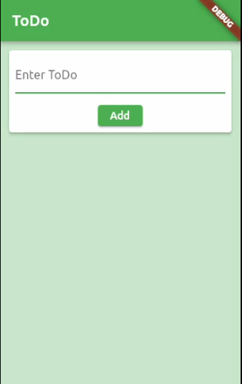

# todo_app
Simple todo app written with clean architecture
  - cubit for state management
  - hive for database
  - todo 
    - list all todos
    - add todo
    - mark as done
    - delete todo

## Screenshots 
<table>
  <tr>
    <td></td>
    <td></td>
     </tr>
 </table>